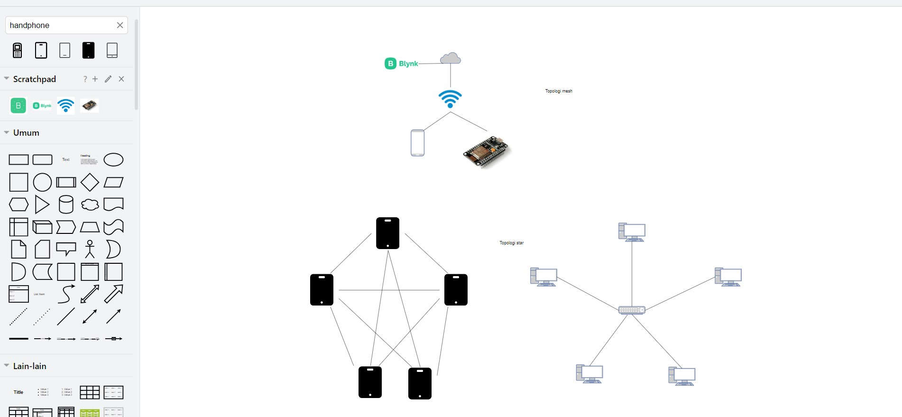

# Pengembangan infrastruktur jaringan

Dari beberapa paper ini, akan saya buat review dan saran pengembangan infrastruktur jaringan berupa topologi beserta deskripsinya.

**Review paper (jurnal)**
1. Sistem Perekam Detak Jantung Berbasis Internet Of Things (IoT) dengan Menggunakan Pulse Heart Rate Sensor : Jurnal tersebut membahas tentang pengembangan sistem perekam detak jantung berbasis Internet of Things (IoT) yang menggunakan sensor detak jantung (pulse heart rate sensor). Sistem ini dirancang untuk mengukur dan merekam detak jantung seseorang secara real-time atau dalam interval waktu tertentu. Data yang dikumpulkan oleh sensor tersebut kemudian dikirimkan melalui jaringan IoT, seperti WiFi atau Bluetooth, ke server atau platform yang dapat diakses melalui internet.

2. Utilizing neural networks with CICIDS2018 dataset for detecting brute force attack anomalies in intrusion detection systems : Jurnal tersebut membahas penggunaan jaringan saraf (neural networks) dengan dataset CICIDS2018 untuk mendeteksi anomali serangan brute force dalam sistem deteksi intrusi. Dalam konteks jurnal ini, jaringan saraf digunakan sebagai alat untuk mempelajari pola dari data yang ada dalam dataset tersebut. Jaringan saraf merupakan model komputasi yang terinspirasi oleh struktur jaringan saraf biologis, dan memiliki kemampuan untuk belajar dari data yang diberikan dan membuat prediksi atau deteksi berdasarkan pembelajaran tersebut.

3. Jurnal tersebut membahas pengembangan prototipe sistem kontrol otomatis untuk suhu air dan keasaman dalam akuarium ikan hias berbasis Internet of Things (IoT). Sistem ini dirancang untuk memantau dan mengatur suhu air dan tingkat keasaman (pH) dalam akuarium secara otomatis menggunakan teknologi IoT.

## Topologi Jaringan

## Kesimpulan
**Berikut adalah kesimpulan dari ketiga jurnal yang telah disebutkan:**

1. Sistem Perekam Detak Jantung Berbasis Internet of Things (IoT) dengan Menggunakan Pulse Heart Rate Sensor:
Jurnal ini membahas pengembangan sistem yang memanfaatkan teknologi IoT dan sensor detak jantung untuk merekam detak jantung secara real-time atau dalam interval tertentu.
Tujuan utama dari sistem ini mungkin termasuk pemantauan kesehatan jarak jauh, diagnosis penyakit jantung, pelacakan aktivitas fisik, dan penelitian ilmiah terkait kesehatan dan kebugaran.
Kesimpulan dari jurnal ini kemungkinan mencakup penerapan teknologi IoT dalam pemantauan kesehatan dan kebugaran serta potensinya dalam meningkatkan aksesibilitas dan efisiensi dalam perawatan kesehatan.

2. Utilizing Neural Networks with CICIDS2018 Dataset for Detecting Brute Force Attack Anomalies in Intrusion Detection Systems:
Jurnal ini membahas penggunaan jaringan saraf dengan dataset CICIDS2018 untuk mendeteksi anomali serangan brute force dalam sistem deteksi intrusi.
Kesimpulan dari jurnal ini mungkin mencakup efektivitas jaringan saraf dalam mendeteksi serangan brute force, peningkatan dalam keandalan dan akurasi deteksi, serta implikasi terhadap keamanan sistem informasi.

3. Prototype of Automatic Control System for Water Temperature and Acidity in Ornamental Fish Aquarium Based on Internet of Things (IoT):
Jurnal ini membahas pengembangan prototipe sistem kontrol otomatis untuk suhu air dan keasaman dalam akuarium ikan hias berbasis IoT.
Kesimpulan dari jurnal ini mungkin termasuk penerapan teknologi IoT dalam pemeliharaan akuarium ikan hias, kemudahan penggunaan sistem otomatis, dan manfaatnya dalam meningkatkan kondisi lingkungan untuk ikan hias.
